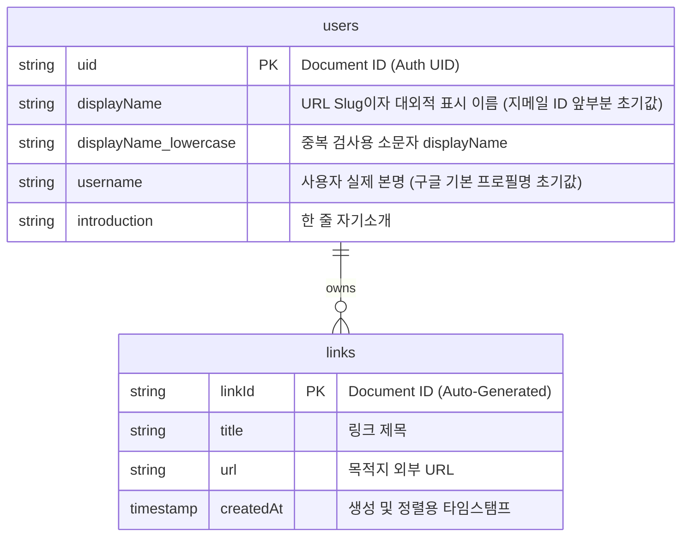

# 마이링크 (MyLink) 데이터베이스 모델링 및 설계서

본 문서는 Cloud Firestore를 기반으로 하는 '마이링크' 서비스의 데이터 구조와 보안 규칙, 그리고 데이터 정합성 유지 기법을 정의합니다.

---

## 1. 개요 및 스키마 관계도 (ERD)

마이링크는 다중 사용자를 지원하는 텍스트 링크 공유 플랫폼입니다. 각 사용자는 단일한 프로필(`users`)을 소유하며, 그 하위에 여러 개의 링크(`links`)를 가집니다.

본 설계에서는 사용자의 **디스플레이 네임(displayName)**이 URL Slug 역할을 하여 퍼블릭 라우팅 주소(`/:displayName`)로 사용됩니다. 최초 로그인 시 구글 지메일 아이디의 앞부분을 추출하여 초기 `displayName`으로 삼으며, 사용자의 본명은 `username` 필드로 별도 관리합니다.



---

## 2. 컬렉션 스펙 정의

### 2.1 Collection: `users`
- **경로**: `/users/{uid}`
- **설명**: 가입된 사용자별 고유한 프로필과 식별 정보를 저장합니다.

| 필드명 | 데이터 타입 | 필수 여부 | 기본값 | 설명 |
| :--- | :--- | :---: | :--- | :--- |
| `displayName` | `string` | **Yes** | 구글 지메일 아이디 앞부분 | URL Slug이자 프로필 최상단 노출 표시 이름. 영문/숫자/하이픈/언더바 조합 |
| `displayName_lowercase` | `string` | **Yes** | 구글 지메일 아이디 앞부분 (소문자) | 대소문자 무관 중복 검사용 소문자 displayName |
| `username` | `string` | **Yes** | 구글 기본 프로필 이름 | 사용자의 실제 본명 |
| `introduction` | `string` | No | `""` | 사용자의 한 줄 자기소개 텍스트 |

### 2.2 Sub-Collection: `links`
- **경로**: `/users/{uid}/links/{linkId}`
- **설명**: 사용자가 등록한 개별 외부 주소 링크들의 목록입니다.

| 필드명 | 데이터 타입 | 필수 여부 | 기본값 | 설명 |
| :--- | :--- | :---: | :--- | :--- |
| `title` | `string` | **Yes** | `"새 링크"` | 화면에 렌더링될 링크 텍스트 타이틀 |
| `url` | `string` | **Yes** | `""` | 리다이렉트될 타겟 주소 (예: `https://github.com`) |
| `createdAt` | `timestamp` | **Yes** | 서버 현재 시간 | 대시보드 및 퍼블릭 뷰에서 생성 순서(오름차순) 정렬 기준 |

> [!NOTE]
> **파비콘 API 활용 정책**
> - 링크 아이콘 이미지 파일은 DB에 직접 저장하거나 업로드하지 않습니다.
> - 프론트엔드 단에서 `url` 필드를 파싱하여 도메인을 추출한 뒤, Google Favicons API를 통해 실시간으로 이미지를 요청하여 UI에 렌더링합니다:
>   `https://www.google.com/s2/favicons?sz=64&domain={domain}`

---

## 3. 데이터 일관성 및 중복 검사 설계

### 3.1 디스플레이 네임(displayName) 고유성 및 URL Slug 매핑
사용자의 `displayName`은 퍼블릭 URL 경로가 되므로 시스템 내에서 완전히 고유해야 합니다.
1. **가입 시 초기화**: 구글 로그인 연동 시, `user.email`이 `hyeonjeong1213@gmail.com`인 경우 `@` 앞부분인 `hyeonjeong1213`을 파싱하여 `displayName` 및 `displayName_lowercase`로 기본 저장합니다.
2. **소문자 변환 저장**: Firestore 중복 쿼리 효율성을 위해 `displayName_lowercase` 필드에 항상 소문자 상태를 미러링하여 저장합니다.
3. **실시간 중복 쿼리 검증**: 디스플레이 네임 인라인 편집 시, Firestore에서 `displayName_lowercase == {입력한소문자이름}` 조건으로 본인 이외의 다른 유저 도큐먼트가 존재하는지 검증합니다.
   - 쿼리 조건: `where("displayName_lowercase", "==", newDisplayName.toLowerCase())`
   - 본인이 아닌 타 유저의 도큐먼트가 발견되면 중복 오류로 판단해 변경을 취소하고 경고 메시지를 보여줍니다.

### 3.2 URL 형식 자동 교정
- 사용자가 `url` 필드를 인라인 편집할 때 `http://` 또는 `https://`가 누락된 경우, 정규식 검사를 거쳐 접두사를 자동으로 붙여 Firestore에 저장합니다. (예: `github.com` -> `https://github.com`)

---

## 4. Firestore 보안 규칙 (Security Rules) 제안

```javascript
rules_version = '2';
service cloud.firestore {
  match /databases/{database}/documents {
    
    // 1. users 컬렉션 규칙
    match /users/{uid} {
      allow read: if true;
      allow create, update: if request.auth != null && request.auth.uid == uid;
      allow delete: if false;
    }
    
    // 2. links 서브 컬렉션 규칙
    match /users/{uid}/links/{linkId} {
      allow read: if true;
      allow write: if request.auth != null && request.auth.uid == uid;
    }
  }
}
```
