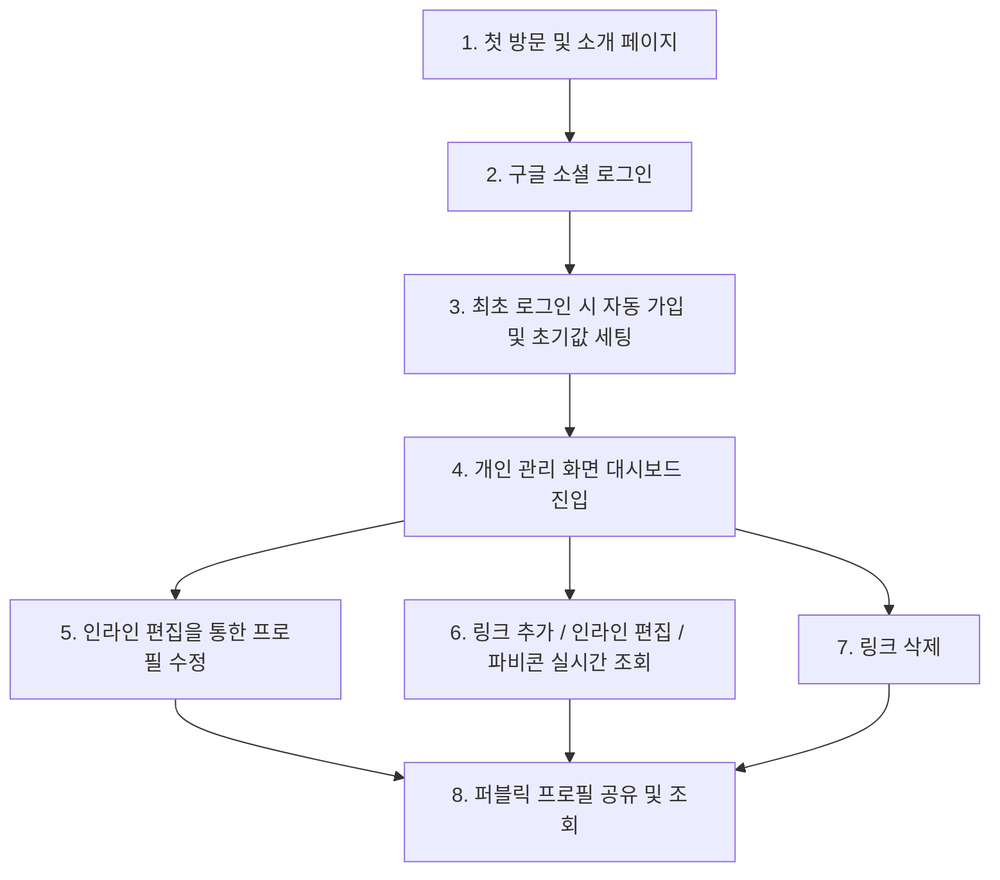

# 마이링크 (MyLink) 상세 사용자 시나리오

본 문서는 사용자가 마이링크 서비스를 처음 접하고, 가입하여 자신만의 미니멀 링크 페이지를 구성하고 타인에게 공유하는 전 과정을 단계별 시나리오로 상세히 기술합니다.

---

## 시나리오 흐름도 (User Flow)

---

## 1. 단계별 상세 시나리오

### 단계 1: 첫 방문 및 소개 페이지
* **상황**: 제3자 또는 신규 사용자가 서비스 루트 경로 `http://localhost:5173/`에 접속합니다.
* **사용자 경험 (UI/UX)**:
  * 극도의 미니멀리즘과 세련된 다크 모드 기반의 글래스모피즘(Glassmorphism) 인트로 카드를 보게 됩니다.
  * "가장 심플하게 나를 표현하는 한 장의 링크 페이지, 마이링크"라는 강렬한 한 줄의 서비스 소개가 적혀 있습니다.
  * 하단에는 깔끔하게 디자인된 **"Google 계정으로 시작하기"** 버튼이 하나만 노출됩니다.

### 단계 2: 구글 소셜 로그인
* **상황**: 사용자가 "Google 계정으로 시작하기" 버튼을 클릭합니다.
* **사용자 경험 (UI/UX)**:
  * 별도의 복잡한 이메일 가입 절차 없이, 익숙한 구글 로그인 팝업 창이 열립니다.
  * 사용자는 본인의 구글 계정을 선택하여 로그인을 진행합니다.

### 단계 3: 최초 로그인 시 자동 가입 및 정보 세팅
* **상황**: 구글 인증이 성공하고, 서비스 시스템에서 신규 사용자로 감지합니다.
  * *가정*: 로그인한 사용자의 구글 지메일은 `hyeonjeong1213@gmail.com` 이며 구글 프로필의 기본 이름은 `황현정` 입니다.
* **시스템 비즈니스 로직**:
  1. Firestore의 `/users/{uid}` 경로에 새 문서가 자동 생성됩니다.
  2. 사용자의 지메일 아이디 앞부분(`hyeonjeong1213`)을 자동으로 추출하여 **`displayName`** 필드의 초기값으로 지정합니다. (이 값이 사용자 페이지의 고유 URL 주소가 됩니다)
  3. 구글 프로필 이름(`황현정`)을 실제 본명에 매핑되는 **`username`** 필드의 초기값으로 자동 저장합니다.
  4. 소개글(`introduction`)은 빈 값(`""`)으로 초기 세팅합니다.
  5. 처리가 완료되면 로딩 인디케이터가 사라지며 즉시 대시보드 화면(`/`)으로 매끄럽게 전환됩니다.

### 단계 4: 개인 관리 대시보드 진입
* **상황**: 가입이 완료된 사용자가 관리용 대시보드 화면에 진입합니다.
* **사용자 경험 (UI/UX)**:
  * 상단에 본인의 프로필 영역(displayName, username, introduction)이 깔끔한 텍스트 뷰 형태로 표시됩니다.
  * "닉네임(displayName) 클릭 시 변경", "이름 클릭 시 변경", "소개를 추가해보세요(클릭)" 와 같이 클릭해서 바로 수정할 수 있음을 알려주는 은은한 안내 가이드 툴팁 또는 미니멀한 힌트 텍스트가 노출됩니다.
  * 프로필 영역 우측에는 타인에게 링크를 바로 복사해서 보낼 수 있는 **"내 페이지 링크 복사"** 버튼이 아이콘과 함께 제공됩니다.
  * 화면 하단에는 등록된 링크 목록과 함께 **"+ 새 링크 추가"** 액션 버튼이 배치됩니다.

### 단계 5: 인라인 편집(Inline Edit)을 통한 프로필 수정
* **상황**: 사용자가 프로필 정보를 변경하고자 텍스트를 클릭합니다.
* **사용자 경험 (UI/UX) 및 로직**:
  * **displayName(URL Slug) 수정**:
    1. 사용자가 현재의 `hyeonjeong1213` 텍스트를 클릭합니다.
    2. 그 즉시 텍스트가 포커스된 테두리 없는 세련된 `<input>` 텍스트 필드로 부드럽게 전환됩니다.
    3. 사용자가 `hyeonjeong_dev`로 타이핑한 뒤 `Enter` 키를 누르거나 입력 창 바깥을 클릭(`onBlur`)합니다.
    4. 시스템은 Firestore에 실시간 중복 조회를 즉시 날려 `hyeonjeong_dev`가 사용 가능한지 체크합니다.
       * **사용 가능할 때**: 입력창이 사라지고 성공적인 토스트 알림과 함께 `hyeonjeong_dev` 텍스트 뷰로 다시 돌아갑니다. 이제 사용자의 퍼블릭 URL은 `도메인/hyeonjeong_dev`로 변경됩니다.
       * **이미 존재할 때 (중복)**: "이미 사용 중인 디스플레이 네임입니다" 라는 붉은색 에러 메시지가 인라인 또는 토스트로 발생하며, 기존의 `hyeonjeong1213`으로 롤백됩니다.
  * **username(실명) 수정**:
    1. 사용자가 `황현정` 텍스트를 클릭해 `황현정 (프론트엔드)`으로 타이핑 후 입력 영역을 벗어납니다.
    2. 즉시 Firestore의 `username` 필드가 업데이트되며, 별도의 로딩 화면 없이 텍스트 뷰 상태로 복귀합니다.
  * **introduction(자기소개) 수정**:
    1. 사용자가 `소개를 추가해보세요`라는 빈 곳을 클릭합니다.
    2. 텍스트 필드보다 넓은 영역을 커버하기 위해 아름답게 디자인된 인라인 `<textarea>`가 등장합니다.
    3. `미니멀리즘과 완벽한 코드를 사랑합니다.`라고 입력하고 포커스를 해제하면 즉시 저장됩니다.

### 단계 6: 링크 추가 / 인라인 편집 / 파비콘 실시간 조회
* **상황**: 사용자가 자신의 퍼블릭 페이지에 올릴 외부 채널 링크를 새로 등록하고 편집합니다.
* **사용자 경험 (UI/UX) 및 로직**:
  1. 사용자가 **"+ 새 링크 추가"** 버튼을 클릭합니다.
  2. 목록 최상단에 은은한 페이드인 애니메이션과 함께 새 링크 카드가 추가됩니다.
     * 초기값: 제목 - `새 링크`, 주소 - `https://`
  3. 사용자는 제목 부분(`새 링크`)을 탭하여 `내 개인 깃허브`로 변경하고 엔터를 쳐 저장합니다.
  4. 사용자는 주소 부분(`https://`)을 탭하여 `github.com/hyeonjeong1213`으로 입력한 후 포커스를 해제합니다.
  5. **URL 자동 교정 및 파비콘 실시간 로드**:
     * 시스템은 주소 입력 시 `http`나 `https` 스키마가 없는 것을 인지하고, 자동으로 `https://github.com/hyeonjeong1213`으로 정규식 교정하여 Firestore에 저장합니다.
     * Firestore 저장 완료와 동시에, 프론트엔드는 URL 도메인을 파싱하여 `github.com`을 추출합니다.
     * 추출된 도메인을 활용하여 **구글 파비콘 API**(`https://www.google.com/s2/favicons?sz=64&domain=github.com`)로부터 파비콘 이미지를 받아와, 해당 링크 카드 좌측에 실시간으로 깜빡임 없이 부드럽게 렌더링합니다!

### 단계 7: 링크 삭제
* **상황**: 사용자가 불필요해진 링크를 삭제합니다.
* **사용자 경험 (UI/UX)**:
  * 각 링크 카드의 우측 끝에 마우스를 올리거나 터치하면 은은하게 휴지통/X 아이콘이 노출됩니다.
  * 아이콘을 클릭하는 순간, 별도의 번거로운 확인용 확인창(Confirm Modal)을 띄워 흐름을 방해하지 않고, 카드가 페이드아웃 되면서 목록 위아래의 카드들이 자연스럽게 빈자리를 채우며 목록에서 완전 삭제됩니다.
  * Firestore에서도 즉시 해당 링크 도큐먼트가 삭제됩니다.

### 단계 8: 퍼블릭 프로필 공유 및 조회 (최종 결과물)
* **상황**: 다른 사용자가 소셜 미디어나 프로필 링크에 등록된 사용자의 퍼블릭 주소(`http://localhost:5173/hyeonjeong_dev`)로 접속합니다.
* **사용자 경험 (UI/UX)**:
  * 대시보드의 편집적인 요소(편집 인풋창, 삭제 버튼, 추가 버튼)는 일체 노출되지 않는 극도로 우아한 완성형 단일 페이지를 마주합니다.
  * 세련된 그라데이션 백그라운드 위에, 사용자의 `displayName`(`hyeonjeong_dev`), 실제 본명인 `username`(`황현정 (프론트엔드)`), 그리고 한 줄 소개(`미니멀리즘과 완벽한 코드를 사랑합니다.`)가 깔끔하게 렌더링되어 있습니다.
  * 그 아래에는 구글 API를 통해 자동으로 가져온 고화질 깃허브 파비콘 아이콘이 달린 `내 개인 깃허브` 텍스트 카드가 표시됩니다.
  * 방문자가 링크 카드를 클릭하면 새 창(`target="_blank"`)이 열리며 사용자의 깃허브로 안전하고 빠르게 이동합니다.
