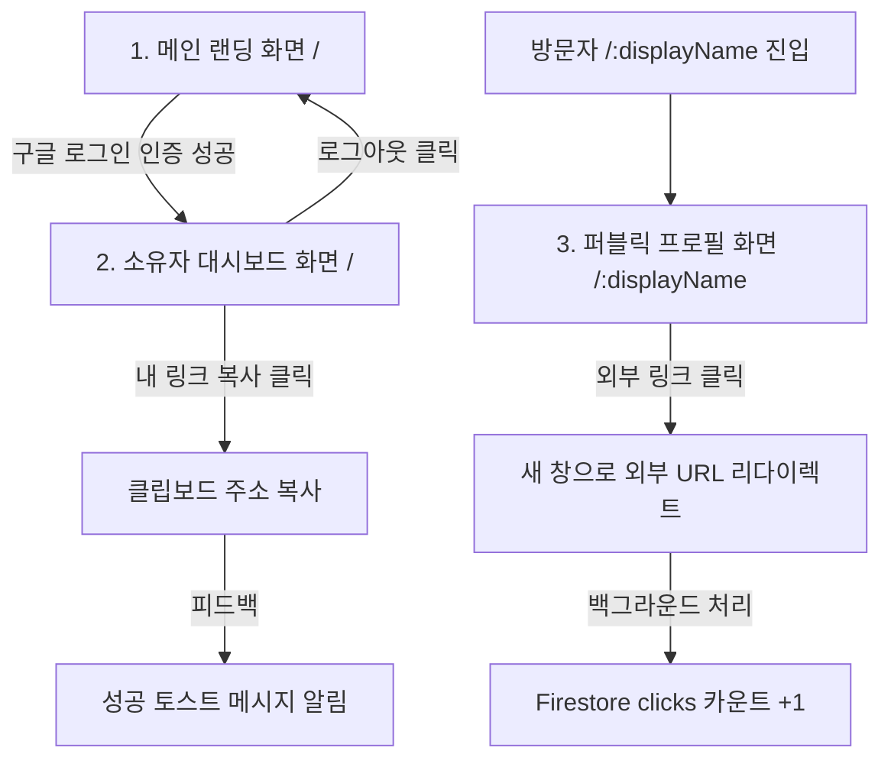

# 마이링크 (MyLink) 와이어프레임 설계서

본 문서는 마이링크 서비스의 핵심 화면인 **1) 메인 랜딩 화면, 2) 소유자 대시보드 화면, 3) 퍼블릭 프로필 화면**의 UI 컴포넌트 구조 및 레이아웃을 마크다운 아스키 레이아웃과 Mermaid 다이어그램을 병용하여 정의한 와이어프레임 설계 명세서입니다.

---

## 1. 전체 화면 흐름도 및 네비게이션 구조



---

## 2. 화면별 세부 와이어프레임 설계

### 2.1 메인 랜딩 화면 (로그인 전 루트 경로 `/`)
* **목적**: 서비스 소개 및 간편한 구글 소셜 로그인 유도.
* **레이아웃 구조**: 극도의 미니멀리즘 중앙 정렬 배치.

```text
+-------------------------------------------------------------+
|                                                             |
|                                                             |
|                                                             |
|                    ⚡ 마이링크 (MyLink)                     |
|                                                             |
|            "가장 심플하게 나를 표현하는 한 장의 링크"       |
|                                                             |
|         +---------------------------------------------+     |
|         |                                             |     |
|         |           [ G 계정으로 간편 시작 ]          |     |
|         |                                             |     |
|         +---------------------------------------------+     |
|                                                             |
|                                                             |
|                                                             |
|                                         Created by Google   |
+-------------------------------------------------------------+
```

#### 컴포넌트 명세
| 영역명 | 컴포넌트 타입 | 액션 / 동작 | 설명 |
| :--- | :--- | :--- | :--- |
| **서비스 타이틀** | `Typography.H1` | - | 세련된 폰트가 적용된 로고 텍스트 |
| **서비스 설명** | `Typography.Sub` | - | 서비스의 핵심 가치를 나타내는 은은한 텍스트 |
| **구글 로그인 버튼**| `Button` | 클릭 시 구글 Auth 팝업 트리거 | 구글 소셜 로그인 전용 세련된 UI 버튼 |

---

### 2.2 소유자 대시보드 화면 (로그인 후 루트 경로 `/`)
* **목적**: 자신의 프로필 영역 및 등록된 링크 카드 목록을 전부 실시간 인라인 편집 형태로 직접 관리.
* **레이아웃 구조**: 중앙 집중형 모바일 퍼스트 카드 배치 (다크 모드 & 글래스모피즘).

```text
+-------------------------------------------------------------+
|  [MyLink (로고)]                              [로그아웃 🔓] |
+-------------------------------------------------------------+
|                                                             |
|   +-----------------------------------------------------+   |
|   |  프로필 편집 구역 (인라인 에디팅 활성)              |   |
|   |                                                     |   |
|   |  ID(Slug)  : @ [ hyeonjeong1213 | ✎ ]  (중복 검사)  |   |
|   |  실명(Name):   [ 황현정          | ✎ ]                |   |
|   |  소개글    :   [ 소개를 작성해 보세요... | ✎ ]     |   |
|   |                                                     |   |
|   |                 [ 🔗 내 페이지 링크 복사 ]          |   |
|   +-----------------------------------------------------+   |
|                                                             |
|   링크 목록 구역 (오름차순 시간 순 정렬)                    |
|                                                             |
|   +-----------------------------------------------------+   |
|   |  [Icon]  제목: [ 내 개인 깃허브        | ✎ ]       |   |
|   |          주소: [ github.com/hyeonjeong | ✎ ]       |   |
|   |                                                     |   |
|   |  📊 누적 클릭: 42회                       [삭제 🗑️] |   |
|   +-----------------------------------------------------+   |
|                                                             |
|   +-----------------------------------------------------+   |
|   |  [Icon]  제목: [ 내 기술 블로그        | ✎ ]       |   |
|   |          주소: [ hyeon-dev.tistory     | ✎ ]       |   |
|   |                                                     |   |
|   |  📊 누적 클릭: 15회                       [삭제 🗑️] |   |
|   +-----------------------------------------------------+   |
|                                                             |
|   +-----------------------------------------------------+   |
|   |                 ➕ 새 링크 추가                     |   |
|   +-----------------------------------------------------+   |
|                                                             |
+-------------------------------------------------------------+
```

#### 컴포넌트 명세
| 컴포넌트ID | 컴포넌트 타입 | 텍스트 상태 및 인라인 에디팅 조건 | 비즈니스 로직 |
| :--- | :--- | :--- | :--- |
| **로그아웃 버튼** | `Button` | 세션 클리어 후 `/` 홈 리다이렉션 | Auth signOut 연동 |
| **displayName(Slug)** | `InlineEdit (Input)`| 클릭 시 `<input>` 전환. 영문/숫자/하이픈만 허용 | 수정 완료 시 중복 쿼리 검사 후 반영 |
| **username(본명)** | `InlineEdit (Input)`| 클릭 시 `<input>` 전환. 실명 표기 | Blur/Enter 시 Firestore users 수정 |
| **introduction(소개)**| `InlineEdit (TextArea)`| 클릭 시 `<textarea>` 전환. 개행 지원 | Blur 시 Firestore users 수정 |
| **내 페이지 링크 복사** | `Button` | 클릭 시 복사 완료 토스트 알림 발생 | `navigator.clipboard.writeText` 호출 |
| **링크 카드** | `Card` | 리스트 페이드인/아웃 애니메이션 탑재 | links 서브 컬렉션 목록 바인딩 |
| **링크 아이콘(파비콘)**| `Image` | 사용자 업로드 없이 URL 기반 자동 렌더링 | 구글 API `?domain={domain}` 매핑 |
| **링크 제목** | `InlineEdit (Input)`| 클릭 시 `<input>` 전환 | links.title 수정 |
| **링크 주소** | `InlineEdit (Input)`| 클릭 시 `<input>` 전환 | links.url 수정 (스키마 누락 시 자동 교정) |
| **클릭 카운트 표시** | `Badge` | "📊 누적 클릭: {clicks}회" 표시 | Firestore clicks 데이터 바인딩 |
| **링크 삭제 버튼** | `IconButton` | 카드 우측 마우스 오버 시 페이드인 | 즉시 삭제 트랜잭션 (Confirm 모달 없음) |
| **새 링크 추가 버튼** | `Button` | 리스트 최하단 고정 배치 | 신규 links 도큐먼트 생성 및 시간 정렬 |

---

### 2.3 퍼블릭 프로필 화면 (조회 모드 라우팅 경로 `/:displayName`)
* **목적**: 방문자가 소유자의 프로필 정보와 등록된 외부 채널들을 세련되게 모바일/웹 브라우저에서 열람하고 연결.
* **레이아웃 구조**: 대시보드와 정확히 대칭되나 편집 도구(삭제 버튼, ✎ 에디터, 추가 버튼)가 일체 배제된 극도의 완성형 프로필.

```text
+-------------------------------------------------------------+
|                                                             |
|                                                             |
|   +-----------------------------------------------------+   |
|   |                                                     |   |
|   |                 @ hyeonjeong1213                    |   |
|   |                      황현정                         |   |
|   |       "미니멀리즘과 완벽한 코드를 사랑합니다."      |   |
|   |                                                     |   |
|   +-----------------------------------------------------+   |
|                                                             |
|   +-----------------------------------------------------+   |
|   |  [Icon]            내 개인 깃허브                   |   |
|   +-----------------------------------------------------+   |
|                                                             |
|   +-----------------------------------------------------+   |
|   |  [Icon]            내 기술 블로그                   |   |
|   +-----------------------------------------------------+   |
|                                                             |
|                                                             |
|                                     [ ⚡ 나도 링크 만들기 ] |
+-------------------------------------------------------------+
```

#### 컴포넌트 명세
| 영역명 | 컴포넌트 타입 | 액션 / 동작 | 비즈니스 로직 |
| :--- | :--- | :--- | :--- |
| **displayName** | `Typography.H2` | 편집 불가능. 순수 노출 | URL Slug 파라미터 기반 Firestore 유저 조회 |
| **username** | `Typography.H3` | 편집 불가능. 본명 노출 | users.username 필드 렌더링 |
| **introduction** | `Typography.Paragraph`| 편집 불가능. 은은하게 개행 노출 | users.introduction 필드 렌더링 |
| **링크 카드** | `Card` | 호버 시 부드러운 스케일업 및 블러 효과. **클릭 시 새 탭 이동** | clicks 원자적 증가(`increment(1)`) 트랜잭션 수행 후 타겟 외부 URL 이동 |
| **링크 아이콘** | `Image` | 외부 로고 파비콘 렌더링 (로딩 시 은은한 스켈레톤 UI) | 구글 API `?domain={domain}` 로드 |
| **워터마크** | `LinkButton` | 클릭 시 마이링크 홈페이지(`/`)로 이동 | 서비스 자연스러운 가입 홍보 링크 |
