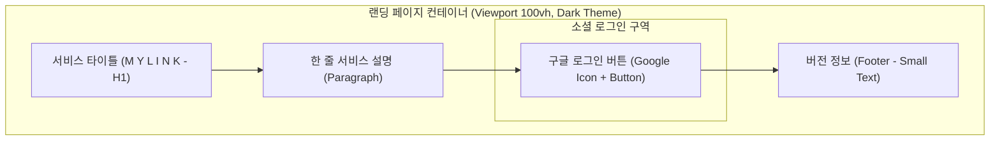
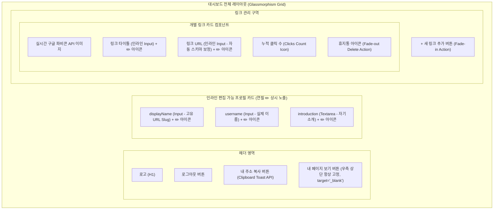
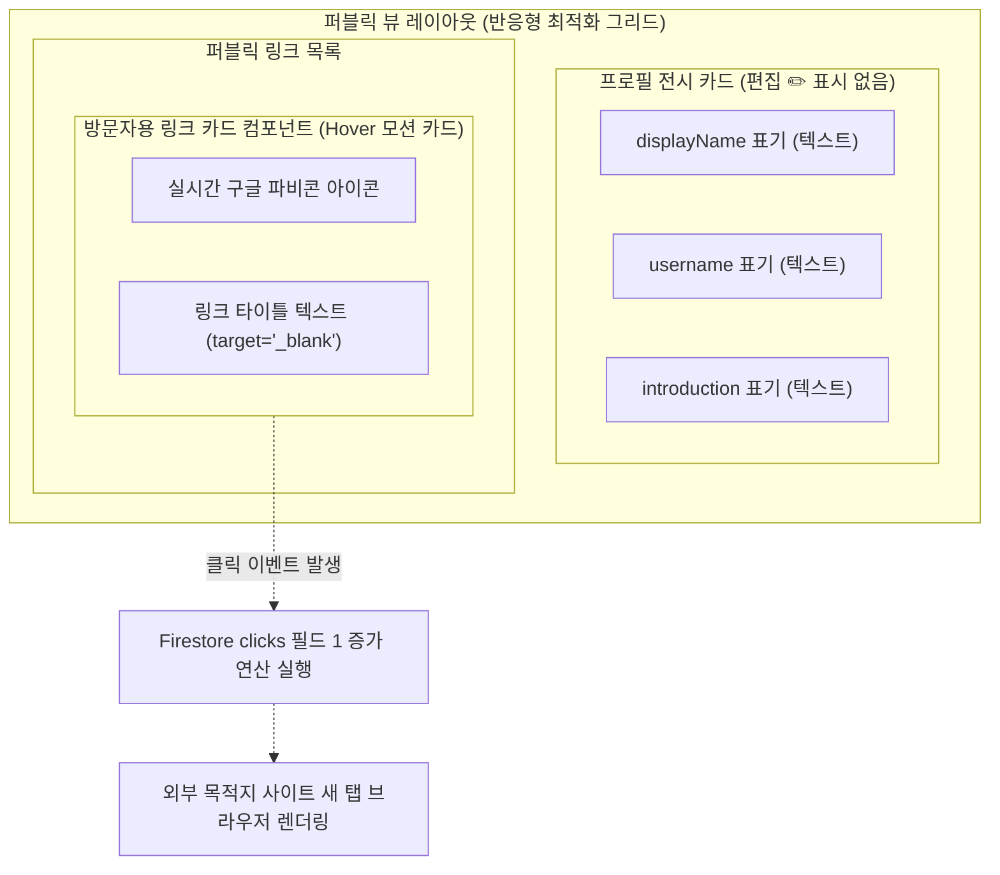

# 마이링크 (MyLink) 와이어프레임 설계서

본 문서는 마이링크 서비스의 UI/UX 설계안을 **ASCII 아트 스타일**, **Mermaid 컴포넌트 다이어그램**, 그리고 **상세 마크다운 명세**를 활용하여 종합적으로 표현한 와이어프레임 설계서입니다.

---

## 1. 랜딩 & 로그인 화면 (Landing & Login Screen)

가입되지 않았거나 로그아웃된 사용자가 메인 도메인에 최초로 접속했을 때 직면하는 초미니멀 랜딩 화면입니다.

### 1.1 ASCII 아트 와이어프레임

```text
+-----------------------------------------------------------------+
|                                                                 |
|                          M Y L I N K                            |
|                                                                 |
|              가장 심플하게 나를 표현하는 한 장의 카드.           |
|                                                                 |
|                     +-----------------------+                   |
|                     | [G] Google로 시작하기 |                   |
|                     +-----------------------+                   |
|                                                                 |
|                                                     v1.0.0      |
+-----------------------------------------------------------------+
```

### 1.2 Mermaid 구조 다이어그램



---

## 2. 관리자 대시보드 화면 (Owner Dashboard Screen)

로그인 완료 후 본인의 주소를 설정하고 외부 링크 카드를 실시간으로 인라인 편집(Inline Edit)하여 가꾸는 관리 도구 레이아웃입니다. 
우측 상단에 **[내 페이지 보기]** 버튼이 항상 고정 노출되며, 편집 가능한 모든 텍스트 영역에는 항상 **연필 아이콘(✏️)**이 기재되어 사용자의 클릭을 직관적으로 유도합니다.

### 2.1 ASCII 아트 와이어프레임

```text
+-----------------------------------------------------------------+
|  [M Y L I N K]                [로그아웃]        [내 페이지 보기]  | <-- (우측 상단 고정 배치)
|  [내 주소 복사]                                                 |
|                                                                 |
|                 +-------------------------------+               |
|                 |    hyeonjeong_dev ✏️           |  <-- displayName (URL Slug & ✏️ 항상 표시)
|                 |    황 현 정 (Dev) ✏️           |  <-- username (실명 & ✏️ 항상 표시)
|                 |                               |               |
|                 |  미니멀리즘과 코드를 사랑하는 ✏️|  <-- introduction (자기소개 & ✏️ 항상 표시)
|                 |  프론트엔드 개발자입니다.     |               |
|                 +-------------------------------+               |
|                                                                 |
|  [+ 새 링크 추가]                                                |
|                                                                 |
|  +-----------------------------------------------------------+  |
|  | [Favicon]  내 개인 GitHub ✏️                       [X]     |  | <-- Title (✏️ 항상 노출)
|  |            https://github.com/hyeonjeong_dev ✏️    👁️: 42   |  | <-- URL (✏️ 항상 노출)
|  +-----------------------------------------------------------+  |
|                                                                 |
|  +-----------------------------------------------------------+  |
|  | [Favicon]  네이버 블로그 ✏️                        [X]     |  |
|  |            https://blog.naver.com ✏️               👁️: 10   |  |
|  +-----------------------------------------------------------+  |
|                                                                 |
+-----------------------------------------------------------------+
```

### 2.2 Mermaid 구조 다이어그램



---

## 3. 퍼블릭 프로필 화면 (Public Profile Screen)

제3자 및 일반 방문자가 사용자의 고유 주소(`/:displayName`)로 직접 진입했을 때 마주하는, 연필 아이콘이나 편집 기능이 완전히 탈거된 미니멀리즘 링크 트리 화면입니다.

### 3.1 ASCII 아트 와이어프레임

```text
+-----------------------------------------------------------------+
|                                                                 |
|                                                                 |
|                 +-------------------------------+               |
|                 |       hyeonjeong_dev          |               |
|                 |       황 현 정 (Dev)          |               |
|                 |                               |               |
|                 |  미니멀리즘과 코드를 사랑하는 |               |
|                 |  프론트엔드 개발자입니다.     |               |
|                 +-------------------------------+               |
|                                                                 |
|  +-----------------------------------------------------------+  |
|  | [Favicon]  내 개인 GitHub                                 |  | <-- 클릭 시 새 창 링크 이동 및 Clicks 1 증가
|  +-----------------------------------------------------------+  |
|                                                                 |
|  +-----------------------------------------------------------+  |
|  | [Favicon]  네이버 블로그                                  |  |
|  +-----------------------------------------------------------+  |
|                                                                 |
+-----------------------------------------------------------------+
```

### 3.2 Mermaid 구조 다이어그램


